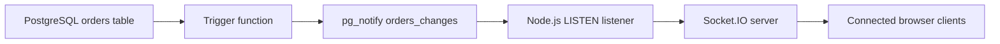

# Realtime DB Updates - Apt Assignment

Backend engineering assignment for realtime database update propagation using Node.js, PostgreSQL, and WebSockets.

The service pushes `orders` table changes to connected clients without polling. PostgreSQL emits change events through triggers and `LISTEN/NOTIFY`; the Node.js backend receives those events and broadcasts them to browser clients through Socket.IO.

## Assignment Objective

Build a working backend service where clients automatically receive database updates when rows are inserted, updated, or deleted. The solution should demonstrate correctness, efficiency, clean backend design, and clear reasoning about realtime systems.

## Tech Stack

- Node.js
- Express.js
- PostgreSQL
- `pg`
- Socket.IO
- dotenv
- Plain HTML/CSS/JS dashboard

## Architecture



Runtime flow:

```text
PostgreSQL Trigger
-> pg_notify()
-> Node.js LISTEN
-> Socket.IO Broadcast
-> Connected Clients
```

Project organization:

- `src/config` loads and validates environment configuration.
- `src/db` owns PostgreSQL connection pooling.
- `src/controllers` translates HTTP requests into service calls.
- `src/services` contains order business logic and persistence workflows.
- `src/routes` defines HTTP routes.
- `src/listeners` receives PostgreSQL notification events.
- `src/sockets` initializes Socket.IO and broadcasts events.
- `src/middleware` contains request logging, async handling, and error handling.
- `src/utils` contains shared utilities.
- `public` contains the realtime dashboard.
- `sql` contains schema and trigger setup.
- `scripts` contains local setup helpers.

## Why LISTEN/NOTIFY

PostgreSQL `LISTEN/NOTIFY` is a strong fit for this assignment because the database can emit an event only when data changes. That avoids repeatedly querying for state that may not have changed, keeps the backend event-driven, and reduces unnecessary database load compared with polling.

The notification payload stays compact and contains the operation, changed order data, and timestamp. For larger systems, this pattern can evolve by publishing IDs only or handing off to a dedicated message broker.

## Why WebSockets

WebSockets give each client a persistent connection for server-initiated updates. That means the server can push changes immediately instead of waiting for the next client request. Socket.IO also provides reconnect behavior and browser-friendly client support.

Polling was intentionally avoided because it creates repeated reads, adds latency between polling intervals, and scales poorly when many clients ask the database the same question over and over.

## API Documentation

Base URL:

```text
http://localhost:3000
```

### Health

```http
GET /health
```

Response:

```json
{
  "status": "ok",
  "service": "realtime-db-updates-api",
  "environment": "development",
  "uptimeSeconds": 42,
  "timestamp": "2026-05-18T18:10:00.000Z"
}
```

### Orders

```http
GET /api/orders
POST /api/orders
PUT /api/orders/:id
DELETE /api/orders/:id
```

Order request body:

```json
{
  "customer_name": "Ada Lovelace",
  "product_name": "Execution Engine",
  "status": "pending"
}
```

Allowed statuses:

- `pending`
- `shipped`
- `delivered`

Validation errors return `400`, missing orders return `404`, and unexpected failures return `500`.

## Realtime Events

Socket.IO event name:

```text
orders:change
```

Example websocket payload:

```json
{
  "operation": "INSERT",
  "order": {
    "id": 1,
    "customer_name": "Ada Lovelace",
    "product_name": "Execution Engine",
    "status": "pending",
    "updated_at": "2026-05-18T22:46:32.5491+05:30"
  },
  "timestamp": "2026-05-18T22:46:32.5491+05:30"
}
```

`operation` can be `INSERT`, `UPDATE`, or `DELETE`.

## Setup Instructions

Install dependencies:

```powershell
npm.cmd install
```

Create a local environment file:

```powershell
Copy-Item .env.example .env
```

Update `DATABASE_URL` in `.env` if your local PostgreSQL credentials differ from the example.

Apply the database schema:

```powershell
npm.cmd run db:schema
```

Apply database triggers:

```powershell
npm.cmd run db:triggers
```

Seed sample data:

```powershell
npm.cmd run seed
```

Start the application:

```powershell
npm.cmd run dev
```

Open the dashboard:

```text
http://localhost:3000
```

Check service health:

```powershell
Invoke-RestMethod http://localhost:3000/health
```

## Folder Structure

```text
RealtimeDbUpdates-Apt-Assignment/
├── logs/
│   └── .gitkeep
├── public/
│   ├── app.js
│   ├── index.html
│   └── styles.css
├── scripts/
│   ├── apply-schema.js
│   ├── apply-triggers.js
│   └── seed.js
├── sql/
│   ├── schema.sql
│   └── triggers.sql
├── src/
│   ├── config/
│   ├── controllers/
│   ├── db/
│   ├── listeners/
│   ├── middleware/
│   ├── routes/
│   ├── services/
│   ├── sockets/
│   └── utils/
├── .env.example
├── .gitignore
├── package-lock.json
├── package.json
└── README.md
```

## Screenshots

Recommended screenshots for submission:

- Dashboard loaded with sample orders and `Connected` websocket status.
- Dashboard event feed after an order insert or update.
- PostgreSQL notification logs showing `Received order database notification`.

## Scalability Discussion

This implementation is intentionally lean for the assignment scope. For a single Node.js instance, PostgreSQL `LISTEN/NOTIFY` plus Socket.IO gives a simple and efficient event-driven pipeline.

For multiple Node.js instances, Socket.IO should use a shared adapter such as Redis so clients connected to different instances receive the same broadcasts. For very high event volume, a dedicated broker such as Kafka, NATS, or Redis Streams would provide stronger buffering, replay, and fanout controls. Notification payloads should also stay compact to avoid pushing large row data through PostgreSQL notifications.

## Future Improvements

- Add authentication and authorization for order APIs and websocket clients.
- Add automated integration tests around trigger and websocket behavior.
- Add pagination/filtering for the orders API.
- Add optimistic UI controls for creating or editing orders from the dashboard.
- Add production observability with structured log collection and metrics.
- Add a Socket.IO adapter for horizontal backend scaling.
